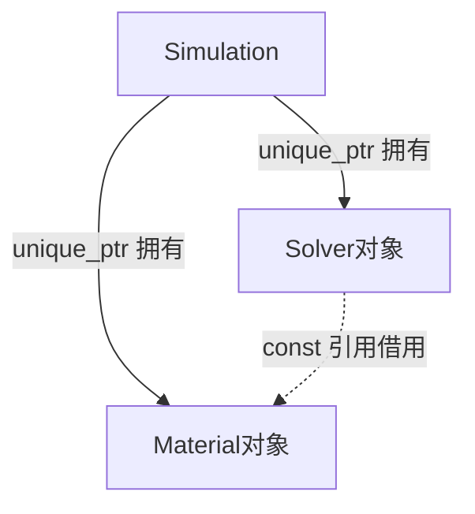

# 第二周：Class、RAII、ownership 与大型源码结构

适用方向：数值仿真 / CAE 算法 / 求解器研发。执行前提：你已完成第一周；本周开头只做短时衔接自测，不重新安排整周的引用与 const 基础。

依据：《仿真与求解器开发_16周求职能力补强学习计划.pdf》第6-7页；同时遵守第2页的学习原则和第36页的停止规则。原计划明确内容与本手册新增的日程、练习参数、验收分数分别说明。配套示例使用 C++17 和标准库，无需 Eigen、OGS 编译或额外测试框架。

## 1. 本周的核心问题与交付成果

第一周关注“这是哪个对象的值或别名、谁能修改、使用时是否仍然有效”。第二周继续追问：**对象在哪里创建？谁负责持有和释放？谁只是使用？资源在正常返回、提前返回和异常退出时如何释放？**

对你的材料本构开发经历，最直接的应用是读懂“工厂函数创建材料对象—交给某个对象或容器持有—局部计算代码借用”的关系。你需要把这条关系变成能解释、能验证的工程证据。

原计划要求的三个成果如下。本手册提供练习起点、参考程序和记录模板；真实 OGS 所有权图与自测答案仍需由你依据本地代码完成。

| 原计划成果 | 本周形成什么 | 通过标准 |
|---|---|---|
| OGS ownership 图 | 选一个真实 create* 工厂，追踪至少一个对象的创建、转移、长期存储、借用和销毁边界 | 图中“拥有/借用/转移”分开标；每条关键边有源码证据 |
| 一个 RAII/智能指针小程序 | Material、Solver、Simulation 教学程序，辅以文件句柄和智能指针小实验 | 正常、提前返回、异常路径可解释；六项综合检查通过 |
| 5 道自测问答 | 第7天闭卷完成五道综合问答 | 自己写答案，包含理由、代码例子或证据位置 |

### 先明确三个边界

**多个模块使用同一个对象，并不自动意味着需要 shared_ptr。** 如果一个长期 owner 能覆盖所有使用者的生命周期，可以由它唯一持有，其他模块通过引用或指针借用。优先选择能表达真实所有权的方式；shared_ptr 适用于确实需要共同延长对象寿命的情况。[C++ Core Guidelines：R.21](https://isocpp.github.io/CppCoreGuidelines/CppCoreGuidelines#Rr-unique)

**调用链不等于所有权链。** 原计划中的 createXXX、Process、LocalAssembler 是查读方向，不保证每个节点都拥有下一个节点。工厂常负责创建和返回，实际长期 owner 可能是成员、容器或其他数据对象，必须查到声明和存储操作。

**RAII 也不等于“所有对象都放进智能指针”。** 局部值对象、成员对象、标准容器和文件流都能通过自身生命周期管理资源。教学程序使用 unique_ptr 是为了练习所有权与多态，不代表实际工程中每个对象都应动态分配。

## 2. 七天总安排与执行方式

保留原计划五个学习单元：90、90、90、120、180分钟，合计570分钟；新增第4天和第7天各30分钟复习与验收，共 **630分钟，即10.5小时**。这是本手册的执行拆分，不是原PDF逐字规定。

| 日期 | 时间 | 对应单元 | 当天任务 | 保存证据 |
|---|---:|---|---|---|
| 第1天 | 90分钟 | 单元1 | 构造/析构最小基础；RAII文件句柄；三种退出路径 | 三条资源释放记录 + 手动管理错误分析 |
| 第2天 | 90分钟 | 单元2 | unique_ptr、shared_ptr；移动、借用、reset/release | 所有权操作表 + 编译失败记录 |
| 第3天 | 90分钟 | 单元3 | class/struct、接口、继承、virtual、override、虚析构 | 材料接口小程序 + 析构顺序解释 |
| 第4天 | 30分钟 | 新增轻复习 | 延迟提取；weak_ptr与循环引用动机 | 错题复测 + 一张循环关系草图 |
| 第5天 | 120分钟 | 单元4 | Material—Solver—Simulation综合练习 | 可运行程序 + M1-M6记录 + 教学所有权图 |
| 第6天 | 180分钟 | 单元5 | 本地OGS工厂与owner追踪；AI图逐边核对 | 真实OGS所有权图 + 证据表 |
| 第7天 | 30分钟 | 新增验收 | 五道问答；两分钟讲述；十五分钟复盘 | 自己的五题答案 + 最多两项补练 |

日期从实际启动日顺延。第6天可拆为两个90分钟时段，休息另计。如果临时少一天，顺延任务顺序，不把三天内容压到一个晚上。

每次采用相同顺序：**先写对象关系和输出预测，再运行/查源码，再解释差异，最后记录证据。** 对每个难点先独立思考10分钟，再查指定小节；仍卡住就提供最小代码向AI索要一个提示。每天末尾的记录时间保留，不全部用来继续看资料。

## 3. 第1天：用三种退出路径理解RAII

**当天目标：** 说清“谁拥有资源、哪次构造取得资源、哪次析构释放资源”；观察正常返回、提前return和被外层catch接住的异常都能释放已取得的资源。

### 按分钟执行

| 时间 | 具体操作 | 完成证据 |
|---|---|---|
| 0-10分钟 | 闭卷回答衔接三题；确认编译环境沿用第一周 | 三题回答及一个待提醒点 |
| 10-25分钟 | 学构造、析构、成员初始化的最小语法；画“包装对象—文件句柄”关系 | 能指认谁负责释放 |
| 25-45分钟 | 分析手动fopen/fclose在提前返回、异常下会遗漏什么 | 两条未执行到释放的路径 |
| 45-65分钟 | 写或补完FileHandle包装；增加三种退出路径 | 三种路径的代码 |
| 65-80分钟 | 先预测日志，再编译运行；对照释放次数与发生时刻 | 三条预测/实际记录 |
| 80-90分钟 | 闭卷复述、记录、修正一个主要错误 | 日志位置、结论和明日复测题 |

### 10分钟衔接自测

1. 第一周的MaterialState&本身会负责销毁状态对象吗？
2. 一个对象被delete后，保存其地址的另一个裸指针会自动置空吗？
3. std::move(x)这个表达式单独出现，就一定已经转移资源了吗？

参考：引用通常表达借用，不自动释放目标；其他裸指针不会自动改变；std::move提供可移动的表达式形式，真正的行为由接收它的操作决定。若其中一题不熟，只复习对应概念，不重做第一周全部任务。

### 最小概念表

| 术语 | 本周需要掌握的含义 |
|---|---|
| constructor | 建立对象的初始状态；资源拥有者可以在此获取资源 |
| destructor | 对象销毁时执行清理；资源拥有者在此结束管理责任 |
| resource | 需要成对获取/释放的东西，例如文件句柄、动态内存、锁 |
| owner | 对资源生命周期承担管理责任的对象或所有权机制 |
| RAII | 将资源管理绑定到对象生命周期，通过析构进行清理 |

析构函数名是~Type()，没有返回类型和普通参数。资源owner的析构通常不向外抛异常。今天只学习这几件事，完整类接口在第3天再展开。

### 先看手动管理哪里容易出错

下面是供审查的片段，不要求运行泄漏版本：

```cpp
std::FILE* f = std::tmpfile();
if (!f) { throw std::runtime_error("open failed"); }
if (stop_early) { return; }  // f没有关闭
work_that_may_throw();      // 若抛出且离开此函数，后面的关闭也被跳过
std::fclose(f);
```

写出两条路径：提前return；work抛出后转到外层catch。分别指出遗漏哪次释放。不必人为制造大量泄漏，也不要把“进程最终回收资源”当作正确的对象管理设计。
    1. 提前 return 会跳过 work_that_may_throw() 以及 std::fclose(f);, 导致 FILE 结构体内存泄漏、临时文件残留磁盘
    2. work_that_may_throw(); 抛出异常后同样会跳过 std::fclose(f); 无法释放内存

### 再用一个真实文件句柄做RAII

参考文件day1_raii.cpp中的FileHandle，取得的是std::tmpfile()返回的临时文件句柄。构造成功才计为一个已取得的句柄，析构调用fclose。临时文件由关闭操作清理，不要求你准备或覆盖研究数据文件。

先自己写下面四个部分：构造时检查句柄是否有效；提供write()写入一条记录；析构时关闭句柄；禁止复制这个拥有者。

```cpp
FileHandle(FileHandle const&) = delete;
FileHandle& operator=(FileHandle const&) = delete;
```

这两行在本例中避免两个包装对象错误地共同关闭同一个裸句柄。今天只理解“不能默认复制唯一资源owner”；不要求手写移动构造或背完整特殊成员函数规则。实际工作通常优先使用已有RAII封装，本例手写包装是为了观察责任边界。

### 三条路径的预期结果

| 实验 | 路径 | 日志的关键先后 | 结束时 |
|---|---|---|---|
| R1 | 正常到函数末尾 | open normal → normal body end → close normal | 打开的句柄计数回到0 |
| R2 | 提前return | open early → early return → close early | 计数回到0 |
| R3 | 抛异常，main中catch | open exception → throw → close exception → caught | 计数回到0 |

不能只记录最后的0，还要检查R3中close发生在外层caught之前。这显示离开函数时发生了清理。RAII不承诺进程被强制终止、abort或一切非正常终止路径都会执行析构，本周只验证表中的普通作用域退出与异常展开。[C++工作草案：异常展开中的对象析构](https://eel.is/c++draft/except.ctor)

### 当天自测与停止条件

闭卷回答：谁是owner？指针成员与包装对象是什么关系？为什么return不跳过本例析构？为什么本例禁止默认复制？
    1. FileHandle 是 owner, 它通过析构函数承担释放责任;
    2. std::FILE* file_ 是包装对象 FileHandle 的成员变量, 它 "指向" 被管理的资源, 但 ownership 属于包装对象;
    3. 因为 handle 是栈上的局部对象, return 会触发栈展开, 自动调用它的析构函数;
    4. 因为 FileHandle 管理的是独占资源（文件句柄）, 复制会导致双重释放

**通过条件：** 三条记录符合预期；能解释复制包装对象可能造成重复关闭；不把RAII简单定义为“使用unique_ptr”。

如果只记住了日志，换成“动态数组由vector成员管理”的口头例子再解释一次。最多补15分钟，不展开allocator或手动内存池。

**保存：** 资源关系图、R1-R3结果、两条手动管理错误路径。参考程序里的计数器只是观察手段，不是RAII定义的一部分。

## 4. 第2天：区分唯一拥有、共同拥有和仅仅借用

**当天目标：** 能读懂unique_ptr/shared_ptr的所有权意图，预测move、get、reset、release的区别，并解释何时无需shared_ptr。

### 按分钟执行

| 时间 | 操作 | 完成证据 |
|---|---|---|
| 0-10分钟 | 闭卷复述第1天R3路径及copy风险 | 不看代码说出清理原因 |
| 10-25分钟 | 学习下面的所有权表；自己重画三种关系 | 三行图：独占、共享、借用 |
| 25-45分钟 | 编写unique_ptr创建、get、移动、reset的小实验 | U1-U3预测与实际 |
| 45-60分钟 | 补release与消费型接口；做两个预期编译失败案例 | U4-U5及C1/C2诊断 |
| 60-80分钟 | 运行shared_ptr复制/释放序列；审查重复控制块错误 | S1-S5记录和错误解释 |
| 80-90分钟 | 闭卷问答、记录、改一项主要错题 | 当天评分与复测题 |

### 三种关系首先画清楚

| 形式 | 常见意图 | 本周关注点 |
|---|---|---|
| std::unique_ptr<T> | 在其管理规则下唯一负责资源的拥有者 | 不可复制，可移动；析构/reset通过deleter释放资源 |
| std::shared_ptr<T> | 与同一所有权组共同管理资源 | 复制拥有者增加强引用；最后一个强拥有者离开才触发管理的销毁动作 |
| T& / T const& / T* | 现代接口中常用于借用 | 不会自动替owner延长目标寿命；实际旧代码还需检查管理责任 |

下列精确结果针对本练习的单线程、make_unique/make_shared、默认删除器和普通非别名用法。不要据此推断所有自定义删除器、别名shared_ptr或并发情形。

### unique_ptr五个实验

令Resource构造/析构打印日志，并用计数表示仍存活的Resource个数。先写预计输出，再运行day2_ownership.cpp。

| 编号 | 语句/操作 | 必须得出的结论 |
|---|---|---|
| U1 | auto p=make_unique<Resource>(7); auto* r=p.get(); 仅求值std::move(p) | p仍拥有对象；单独的转换不完成转移；get只取得借用地址 |
| U2 | auto q=std::move(p); | p为空，q接管同一个对象；对象地址不变，没有因此重建Resource |
| U3 | q.reset(); | 原对象销毁，q为空；先前借用r失效，不能再解引用 |
| U4 | auto* raw=owner.release(); | owner为空，但对象没有被销毁；管理责任需另行接手 |
| U5 | consume(std::move(input));，consume按值接收unique_ptr | 本例函数接管；若函数未再转交所有权，参数析构时销毁对象 |

U4是识别旧接口所需的演示，参考代码随后显式delete一次以完成配对。日常代码不要为了“拿地址”调用release；只借用时用get即可。也不要在get之后手动delete，而owner仍然认为自己拥有资源。[C++工作草案：unique_ptr](https://eel.is/c++draft/unique.ptr)

关键提醒：移动unique_ptr本身不等于移动其指向的材料对象；在U2这种直接转移中，旧借用可以继续指向仍存活的目标。它最终是否有效，取决于新owner何时销毁/替换该对象。

### 两个预期编译失败实验

```cpp
auto p = std::make_unique<int>(7);
auto q = p;  // C1：不允许复制unique_ptr
```

```cpp
void take(std::unique_ptr<int> p);
take(p);            // C2：这里会尝试复制
take(std::move(p)); // C4：允许转移，本例之后p为空
```

独立编译配套compile_cases.cpp，-DCASE=1、2预期失败，-DCASE=4预期成功。记录错误的核心含义即可，不背编译器长诊断。

先问函数是不是确实应该接管。如果函数只读数值，更合适的签名可能是T const&；不能遇到复制失败就一律加std::move，更不能全部替换成shared_ptr。

用1分钟衔接第一周的const：compile_cases.cpp的-DCASE=5中，const unique_ptr<int>仍可经*p修改int，const限制的是owner句柄自身；若需要经句柄只读目标，应识别unique_ptr<int const>这一不同类型。C5预期编译通过，不延伸更多const组合。

### shared_ptr五个步骤

在独立的新实验中使用a=make_shared<Resource>(13)。参考程序避免了隐藏的额外shared_ptr副本，因此可得到下列计数：

| 步骤 | 操作 | 强引用数/对象状态 |
|---|---|---|
| S1 | 创建a | 1；一个Resource |
| S2 | auto b=a | 2；仍是同一个Resource |
| S3 | auto* view=a.get() | 仍是2；裸指针借用不增加强拥有者 |
| S4 | a.reset() | b观察到1；对象仍存活 |
| S5 | b.reset() | 最后一个强拥有者离开，对象销毁；view不能再使用 |

shared_ptr的复制共享对象，不会自动深复制材料状态。多个使用者需要独立状态时，应该另外设计独立对象/克隆，而不是用共享句柄伪装副本。

只做纸面审查，不运行下面的错误代码：

```cpp
auto a = std::make_shared<Resource>(13);
std::shared_ptr<Resource> b(a.get()); // 错误：从同一裸地址另建所有权组
```

这不会自动加入a的所有权组，可能导致重复删除；应根据意图用auto b=a共享同一组，或只保存非拥有的借用。一个地址看起来相同，不能证明管理责任相同。[C++工作草案：shared_ptr](https://eel.is/c++draft/util.smartptr.shared)

### 当天通过条件

能独立说出get/reset/release三者区别；能解释C1/C2失败而C4成功；S1-S5预测正确；能说明“两处使用”为什么不必然要求“两处拥有”。

如果仍混淆，用三列重新记每一步：当前owner是谁、对象是否存活、借用是否仍有效。今天不研究控制块布局、引用计数性能或线程安全实现；shared_ptr也不等于被指对象自动线程安全。

**保存：** U1-U5、S1-S5操作表，C1/C2编译失败摘要，以及一个“借用足够”和一个“确需共享所有权”的具体场景。

## 5. 第3天：用材料接口理解类、继承和运行时多态

**当天目标：** 能看懂一个材料接口和具体实现；知道构造如何建立状态，virtual如何选择实现，为什么本例的基类析构必须为virtual。

### 按分钟执行

| 时间 | 操作 | 完成证据 |
|---|---|---|
| 0-10分钟 | 闭卷复测unique_ptr转移、get与reset | 三个结论及理由 |
| 10-25分钟 | 学class/struct、public/private、构造初始化列表 | 给最小类逐行写用途 |
| 25-50分钟 | 写Material接口与ElasticMaterial实现 | 可通过基类引用调用stress |
| 50-65分钟 | 写createMaterial工厂，返回unique_ptr<Material> | 说清创建者与返回后的owner |
| 65-80分钟 | 检验override错误与析构日志 | C3编译失败、派生到基类析构顺序 |
| 80-90分钟 | 闭卷解释接口角色并记录 | 一页接口说明与复测题 |

### 只掌握这张语法用途表

| 写法 | 解决的问题 | 本周常见误解 |
|---|---|---|
| class / struct | 定义包含状态与操作的类型 | 二者都可有方法、继承和构造；主要默认访问/继承权限不同 |
| public / private | 表达外部可使用的接口与内部实现 | private不是“不能被对象自己修改” |
| Constructor(...) : member_(...) | 在构造阶段初始化成员 | 成员实际初始化顺序由声明顺序决定，不由列表书写顺序决定 |
| explicit | 限制某些非显式的类型转换 | 看到它先识别意图，不学习全部重载规则 |
| virtual | 允许通过基类接口进行运行时选择 | 不等于所有调用都必须研究虚表布局 |
| = 0 | 纯虚函数，要求具体实现提供相应操作 | 不能把抽象接口直接当完整材料实例来创建 |
| override | 让编译器核对确实覆盖基类虚函数 | 函数名相同并不一定覆盖，const等签名差异会影响 |

class的默认成员访问和默认继承是private，struct相应默认是public。两者都不决定对象位于“栈还是堆”。只需能在当前材料例子中识别这些声明，不扩展多重继承、ABI或复杂设计模式。

### 从三个问题写出材料接口

先回答：上层需要什么操作？具体模型保存什么参数？上层是否应该依赖具体材料类型？本例上层只需要从strain得到stress。

```cpp
class Material {
public:
    virtual ~Material() = default;
    virtual double stress(double strain) const = 0;
};

class ElasticMaterial : public Material {
public:
    explicit ElasticMaterial(double modulus) : modulus_(modulus) {}
    double stress(double strain) const override {
        return modulus_ * strain;
    }
private:
    double modulus_;
};
```

教学参数取modulus=1000、strain=0.01，结果为10。这里的标量关系只用于检查调用落到哪个实现，不替代你的统计损伤模型，也不引入有限元单位系统。

完成evaluate(Material const& material, double strain)，内部只调用material.stress(strain)。然后用ElasticMaterial作为实参；解释静态接口类型是Material，实际对象类型是ElasticMaterial。不要通过复制基类对象实现这次调用；本例Material本身是抽象类。

### 工厂返回：创建和长期持有是两个位置

```cpp
std::unique_ptr<Material> createMaterial(double modulus) {
    return std::make_unique<ElasticMaterial>(modulus);
}

auto material = createMaterial(1000.0);
double sigma = evaluate(*material, 0.01);
```

工厂负责选择和创建具体类型，返回的unique_ptr将所有权交给调用方。在这段代码中，局部material是当前owner，evaluate通过引用借用。实际项目里这个局部owner可能随后继续转移到成员或容器，因此不要停在工厂函数名上就下结论。

### 两个必须亲自核对的点

**覆盖错误：** 把派生类的stress后面的const删掉，保留override。对应compile_cases.cpp的-DCASE=3，预期编译失败。解释应包含“与基类声明的签名不匹配”，不是“C++不允许非const函数”。修回后再编译。

**虚析构：** 运行day3_polymorphism.cpp，预期先输出stress=10，再看到ElasticMaterial析构日志、Material基类析构日志。这里通过unique_ptr<Material>默认删除一个实际派生类对象，要求基类具有可用的虚析构以实现正确的多态销毁。不能简单推广为“所有类的析构都必须virtual”；也不要删除virtual后通过运行未定义行为来推测规则。[C++工作草案：虚函数](https://eel.is/c++draft/class.virtual)、[析构](https://eel.is/c++draft/class.dtor)

一个完整对象的析构过程通常先执行最派生类析构函数体，再销毁其成员，再进入基类析构；成员按其构造完成的逆序销毁。看到“析构函数体开始”的日志，不代表它管理的所有成员已经销毁。[C++工作草案：构造顺序](https://eel.is/c++draft/class.base.init)

### 当天通过条件

能独立解释private参数、const成员函数、纯虚接口、override、虚析构五处用途；能用基类引用得到10；C3失败原因正确；能区分“工厂创建”和“调用方持有”。

如果还不能说清virtual，就固定同一个evaluate接口，给它提供modulus=1000和2000两个对象，比较10和20，并指出究竟哪段函数体执行。不要求另写复杂材料模型。

**保存：** day3材料接口程序、C3错误摘要、构造/析构记录、工厂返回解释。

## 6. 第4天：轻复习与weak_ptr的使用动机

**当天目标：** 隔天仍能解释拥有与借用；理解weak_ptr为什么能作为共享对象的非拥有观察者。

| 时间 | 操作 |
|---|---|
| 0-10分钟 | 闭卷复述get/reset/release；解释为何本例基类需要虚析构。 |
| 10-20分钟 | 预测并运行day4_weak.cpp的第一个观察实验，记录lock前后对象状态。 |
| 20-25分钟 | 画两个节点的强拥有循环，解释把一条回边改成weak后的区别。 |
| 25-30分钟 | 填复测与错题记录；确定第5天最要留意的一项关系。 |

weak_ptr与shared_ptr的共享所有权机制配合，weak本身不延长被管理对象的寿命。lock尝试得到shared_ptr：成功时产生临时强拥有者，失败时得到空shared_ptr。弱引用仍存在不代表目标对象仍存活，也不意味着弱引用相关管理信息一定已经释放。[C++工作草案：weak_ptr](https://eel.is/c++draft/util.smartptr.weak)

### W1：按这个顺序预测

1. 创建一个shared_ptr owner，并将其赋给weak observer：强引用数仍是1。
2. keep=observer.lock()成功：强引用数变为2。
3. owner.reset()：keep仍在，目标对象继续存活。
4. keep.reset()：没有强拥有者，目标销毁；observer.expired()为true。
5. 再次observer.lock()返回空值，不解引用。

这里没有并发。实际使用时通常直接检查lock返回的shared_ptr再访问；不要把一次expired检查当成永久有效的使用保证。

### W2：循环关系只看管理责任

如果A用shared_ptr拥有B，B也用shared_ptr拥有A，即使外部变量都离开，彼此的强拥有关系仍可能阻止销毁。若B到A只是用于回看上级，可将这条回边设计为weak_ptr；参考程序使用A.child强拥有B、B.parent弱观察A。

预测参考程序：外部a.reset后A销毁，B仍由外部b持有；B的parent失效；b.reset后B销毁。两者都释放。不要为了观察循环而故意在研究程序留下泄漏；在纸面上比较两种关系即可。

是否使用weak要依据关系语义，不能机械地把任意一条真正需要共同保活的边变弱。只有一个长期owner且使用期明确时，普通引用或指针可能已经足够。

**通过条件：** W1五步能预测；能说清weak自身不保活、成功lock会暂时保活。循环引用只需理解动机，不研究控制块实现。

## 7. 第5天：实现Material、Solver、Simulation的对象关系

**当天目标：** 用一个小程序同时验证多态接口、工厂创建、唯一所有权转移、借用和析构顺序。

### 按分钟执行

| 时间 | 操作 | 结束证据 |
|---|---|---|
| 0-10分钟 | 不看参考答案，画三个对象的拥有/借用关系 | 初版图和寿命要求 |
| 10-25分钟 | 写Material接口、ElasticMaterial和createMaterial | 工厂返回类型及理由 |
| 25-50分钟 | 写Solver的借用成员和Simulation的owner成员 | 构造与声明顺序 |
| 50-70分钟 | 完成正常路径并加日志；核对虚析构 | 一次完整输出序列 |
| 70-100分钟 | 逐项完成M1-M6，先预测再运行 | 六项通过/失败与原因 |
| 100-110分钟 | 审查三种错误改法，说明正确修复 | 三条修复说明 |
| 110-120分钟 | 关闭答案做两分钟讲述；整理图与记录 | 可重复运行的程序 |

可以从练习起点/day5_mini_solver.cpp开始，保留TODO直到自己完成。它目前能编译，但会明确报告未完成并以退出码2结束；不能只把退出码改成0来标记完成。

### 固定设计约束

| 对象 | 本例保存什么 | 管理责任 |
|---|---|---|
| ElasticMaterial | 标量modulus | 提供stress=strain*modulus的教学计算 |
| Solver | Material const& | 只借用材料；不delete材料、不接管材料所有权 |
| Simulation | unique_ptr<Material>与unique_ptr<Solver> | 拥有两者，并确保Solver的全部使用期内材料仍有效 |
| createMaterial | 按参数创建具体材料并返回unique_ptr<Material> | 负责创建与交付，不自动成为长期owner |

先画拥有和借用，再写代码。下面的图仅描述本教学程序，**不是对OGS实际架构的断言**。



三个节点之间有两条拥有关系和一条借用关系。对象使用关系不能再画成第三条拥有关系。图外补一句：createMaterial创建的对象经返回值与移动参数进入Simulation。

### 第一步：先写接口和成员

```cpp
std::unique_ptr<Material> createMaterial(double modulus);

class Solver {
public:
    explicit Solver(Material const& material);
    double solve(double strain) const;
private:
    Material const& material_;
};

class Simulation {
public:
    explicit Simulation(std::unique_ptr<Material> material);
    double run(double strain) const;
private:
    std::unique_ptr<Material> material_;
    std::unique_ptr<Solver> solver_;
};
```

本例采用按值unique_ptr构造参数来表达接管。把非空材料owner移动到material_后，再用*material_构造借用材料的solver_。如果输入为空，必须在解引用前明确拒绝，例如抛出invalid_argument。

unique_ptr参数表明构造函数可以接管，但是否真正长期保存，还要读成员初始化/赋值。对旧OGS代码也用同样判断方法，不能看到签名就跳过实现。

### 第二步：声明顺序为什么重要

在本例中material_先声明、solver_后声明，因此先构造材料owner，再构造求解器owner；析构时顺序相反，Solver先销毁，Material后销毁。参考程序刻意让Solver析构时读取材料的name，以检验借用在清理阶段仍有效。

不要只交换初始化列表中的书写顺序来修复声明顺序错误。成员初始化按声明顺序进行。也不要在Solver还可能使用材料时，单独对material_执行reset或替换；owner自身还存在不代表其曾经指向的对象仍在。

### 第三步：先预测正常输出

忽略日志拼写，抓住以下关系：ElasticMaterial构造 → Solver构造 → Simulation构造完成 → 计算stress=10 → Simulation析构函数体 → Solver析构时材料仍有效 → ElasticMaterial析构函数体 → Material基类析构。

看到Simulation析构函数体的日志时，成员还未完成销毁。手写日志应区分“析构函数体开始”和“全部资源已经释放”。

### 六个必做实验

教学参数modulus=1000、strain=0.01，预期stress=10；modulus=2000时stress=20。浮点比较用1e-12仅适用于本例小数计算，不用于你的实际有限元容差选择。

| 编号 | 操作 | 预期结果与证据 |
|---|---|---|
| M1 正常退出 | 局部Simulation完成一次run后离开作用域 | 输出10；Solver先于Material销毁；存活计数归零 |
| M2 提前返回 | 辅助函数创建Simulation后return | 同样释放所有拥有对象；无需每条路径手写delete |
| M3 异常展开 | 完成Simulation构造后抛异常，main外层catch | Solver、Material清理发生在catch之前；计数归零 |
| M4 显式转移 | p=createMaterial(2000)；记录p.get()；Simulation sim(std::move(p)) | p为空；sim中的材料地址仍相同；计算20；退出后释放 |
| M5 两个借用者 | 一个unique_ptr材料owner，两个Solver都引用它 | 一个材料对象、两个Solver；可以分别算10和20；无需两个材料owner |
| M6 空输入 | 尝试Simulation(nullptr) | 在解引用前拒绝；不构造可使用的Solver；无资源遗留 |

存活计数器只用来辅助观察。真正判断包括数值、关系和释放顺序；不能只看最终打印了PASS。参考程序没有执行悬空解引用、重复删除或泄漏测试。

### 三种错误改法：只分析风险，修复后再运行

**错误A：复制owner。** 将Simulation sim(std::move(p))写成Simulation sim(p)。预期复制unique_ptr失败；若Simulation确实需要接管，恢复移动。若只是想读取材料，应重新选择借用接口，不能为了消除报错任意转移所有权。

**错误B：制造第二个owner。** 给Solver传std::unique_ptr<Material>(p.get())，而p仍拥有该对象，会导致两个独立拥有者管理同一地址。借用设计应传*material并保存引用；真正转交才使用移动。构造shared_ptr(p.get())也不能自动修复这类重复管理。

**错误C：先销毁目标再保留借用者。** 在Solver仍存在且析构还会读材料时reset材料owner，后续调用或析构会用到失效引用。修复应保证Solver先结束使用并销毁，或重新设计关系；不能只给另一份裸指针置空。

### 当天通过条件

M1-M6全部符合预期；能独立解释为何Solver不拥有材料、为何成员顺序如此、为何移动owner没搬动材料对象；能审查三种错误改法。

如果异常路径的释放顺序仍不清，只重做M3并画四个时间点：构造完成、抛出、成员清理、catch。不扩写非线性迭代、损伤状态机、有限元装配或性能测试。

**保存：** day5小程序、六项预测/实际表、教学所有权图、三条错误修复说明。这些记录共同支撑原计划要求的“一个RAII/智能指针小程序”。

## 8. 第6天：从真实OGS工厂追踪一条完整的所有权关系

**当天目标：** 找到一个对象的创建、返回、转移、长期持有、借用和销毁边界，并画出有证据的OGS所有权图。

本次附件是学习计划，没有你的当前OGS代码。因此这里给出本地查读步骤；具体文件、字段、调用链和owner需要以你本地版本为准。第一周的十条声明笔记可作为候选入口，但其结论仍要在当前源码中核对。

### 按分钟执行

| 时间 | 操作 | 结束证据 |
|---|---|---|
| 0-15分钟 | 记录版本和已有修改，选一个create*函数与一种目标对象 | 查读范围、真实函数名 |
| 15-40分钟 | 阅读工厂返回类型、具体创建语句和返回语句 | P1创建、P2返回证据 |
| 40-75分钟 | 搜索调用者，追踪移动/赋值/容器插入到长期存储 | P3转移、P4owner证据 |
| 75-105分钟 | 找一处借用和实际访问；核对销毁/替换边界 | P5借用、P6寿命证据 |
| 105-130分钟 | 画对象与关系，逐条标注证据编号 | OGS图初版 |
| 130-150分钟 | 提供30-60行真实片段让AI画图，逐边检查 | 自己与AI对照表 |
| 150-170分钟 | 回到源码补证据；对无法核实处保留缺口 | 修订后的图与判断 |
| 170-180分钟 | 两分钟讲述、整理文件、完成自测 | 一条可展示的生命周期解释 |

### 第一步：限定范围并记录版本

在你已经打开的OGS仓库根目录终端中执行：

```bash
git status --short
git branch --show-current
git rev-parse HEAD
rg --files MaterialLib | rg 'Create.*ElasticIsotropicDamage|ElasticIsotropicDamage'
```

如果当前版本没有这些文件，从你实际维护的材料模块中选一个create*工厂；或者选一个更简单、可在半小时内找到调用者的工厂。不是必须选复杂程度最高的对象。

记录已有未提交修改。学习笔记放到独立练习目录；不要为了查读而丢弃已有修改、切换研究分支或改写材料实现。没有rg时使用VS Code全局搜索即可。

### 第二步：先定义“我要追踪的到底是哪一个对象”

写一句话，例如“追踪本次工厂创建的一份材料对象，确认其返回后在哪里长期存储，哪个计算对象借用它”。类型名相同的多个对象不是同一个实例；先选一个代表性创建路径，不把所有材料实例混成一个节点。

记录工厂的完整返回类型。若它是unique_ptr，接着找创建具体实现的语句；若实际返回容器、optional或其他组合，先展开到目标对象那一层，遇到复杂模板只回答谁装着谁，不研究模板实现。

### 第三步：填六项证据

| 编号 | 必须查到什么 | 足够具体的证据 | 不能据此直接断言什么 |
|---|---|---|---|
| P1 创建 | 实际创建目标对象的语句 | make_unique/make_shared/new/按值构造及具体类型 | 工厂之后永远拥有它 |
| P2 返回 | 工厂返回类型和return位置 | 返回值类型、返回表达式 | 结果最终一定存在Process中 |
| P3 转移 | 调用者怎样接收并转交结果 | 初始化、std::move、emplace、构造参数与下游接收 | 仅出现std::move就一定完成永久保存 |
| P4 长期持有 | 哪个成员或容器实际保存owner | 成员声明与对应赋值/初始化位置 | 类名包含Process就必然拥有所有材料 |
| P5 借用 | 谁保存或使用引用/裸指针/get结果 | 参数/成员类型和真实访问位置 | 调用了材料函数就等于拥有材料 |
| P6 销毁边界 | 谁的析构/reset/erase/替换会结束目标寿命 | owner自身生命周期、删除操作或可推导的成员析构关系 | 未找到显式delete就不会销毁 |

每条证据写实际路径、函数名、行号和当前提交号。有未提交修改时注明，不能用提交号假装精确标识修改后的全部内容。

现代C++中不一定存在显式析构函数定义。一个含unique_ptr的成员随其持有对象析构，就足以建立部分释放关系；但这个持有对象自身何时结束仍要查。若材料保存在容器中，还要考察erase、clear或覆盖是否可能比顶层对象析构更早使它失效。

### 三类很值得分清的实际情况

1. **拥有对象的容器与借用者分离。** 可能是某个数据对象的容器保存unique_ptr，计算对象保存Material&。图应画数据对象/容器拥有材料，计算对象借用材料。只有实际查到时才使用这张关系。
2. **借用容器里的unique_ptr句柄与借用其堆上目标不同。** 某些容器操作会移动unique_ptr句柄，但其管理的堆上材料对象未必移动；目标被erase/reset仍会失效。先说明借用的究竟是哪一层，不泛称“容器变化会让一切指针失效”。
3. **const不提供额外寿命保证。** Material const&只限制访问，unique_ptr<T> const&也不自动复制或接管owner。它们是否安全仍需目标或句柄在整个使用期存活。

这些是查读问题，不是对你当前OGS版本的发现。找不到证据时写“待核实”，不要因为模板里有一栏就填一个猜测的owner。

### 实际搜索怎么做

拿到工厂真实名称后，在VS Code全局搜索该名称，先看直接调用者。接着沿接收变量和成员名继续查，不先把全仓库所有unique_ptr展开。

```bash
rg -n 'unique_ptr|shared_ptr|make_unique|make_shared|std::move|\.get\(' \
  MaterialLib ProcessLib
```

上面只是全局候选搜索，命中多时立刻缩小到已找到的文件。再查该文件中的构造函数初始化列表、成员声明、容器插入和访问器。搜索到的文本不等于语义证据，要读关联语句。

每追一层都填一句：“上一层变量是____；在____语句转交给____；下游字段/参数类型为____；我据此判断为拥有/借用/待核实。”连续20分钟没有新增证据，就记录缺口，换更简单的创建路径。

### 所有权图的最低要求

只画一条目标路径，通常4-7个节点足够。节点可包括创建入口、临时owner、长期持有者/容器、材料对象、一个实际借用者。按真实源码选择，不预设Process和LocalAssembler的所有权位置。

| 图上关系 | 标注方式 | 必须附什么 |
|---|---|---|
| 创建 | “创建：真实工厂/构造位置” | P1 |
| 转移 | “unique_ptr移动到字段/容器” | P3 |
| 拥有 | “owns：实际owner类型” | P4 |
| 借用 | “borrows：引用/指针/get” | P5 |
| 失效边界 | 图旁注明析构/reset/erase/替换条件 | P6 |

所有权图表示管理关系；调用顺序可在图旁写一句，避免把create → Process → LocalAssembler画成未经验证的连续拥有链。至少写出一个寿命约束：“借用者的最后一次访问必须早于____销毁/替换目标。”

图下附P1-P6证据索引；无法确认的边用文字标“待核实”，不计入已确认关系。图不需要美工化，必须能返回源码复查。

### AI对照：30-60行真实源码，逐条核对

选择与你的对象路径直接相关的片段，可以来自多个位置，总计约30-60行，每段注明文件与函数。必须同时包含足够的创建、接收/存储和借用信息；缺少时明确告诉AI证据不完整。

```text
我正在核对一个OGS对象的所有权。下面是实际源码与我先画的关系。
请仅依据这些代码区分：创建者、所有权转移、长期owner、借用者、
已能确认的销毁边界。
每条关系附片段中的证据位置；代码不足的关系写“待核实”，
并指出下一步需要哪类声明或调用位置。
不要根据类名、调用关系或惯例猜测owner，也不要修改代码。
最后列出我的图中一处最需要验证的生命周期条件。
```

对AI的每条边记录：我的原判断、AI判断、源码证据、最终结论。若AI猜出不存在的owner，记录为失败案例；若没有发生，也如实记录，不为了满足任务制造一次错误。

### 当天通过条件

P1-P6的主要关系可以说明，至少一条真实材料/资源路径有已确认的长期owner和一个借用者；能解释销毁边界及其对借用的影响；图中关键边有证据；AI结果经逐边核对。

允许保留不影响所选路径判断的外围缺口，例如另一个分支何时创建。但“谁长期持有目标”或“借用者使用时目标是否存活”仍未确认时，该项应标待补，不能把未知箭头当作完整链。

如果本地暂时没有OGS源码，可以先用第5天程序练证据表格式，真实OGS图记待补。无需为了获得源码分析而上传整个研究仓库。

## 9. 第7天：五道问答、两分钟表达和十五分钟复盘

今天不新增知识。0-10分钟闭卷回答五题；10-15分钟对照标准评分并用两分钟讲述一个实例；15-30分钟做原计划的五项周复盘。

### 原计划要求的五道自测问答

**Q1：** 用第1天文件句柄说明RAII的对象、资源和释放责任。为什么提前return和被外层catch接住的异常都能清理？哪些退出方式没有由本实验保证？
         RAII 的对象是 FileHandle 实例本身; 资源是 std::FILE *file_ 指向的文件句柄; 释放责任由 FileHandle 对象承担, 通过析构函数完成
         return 会结束函数执行, 此时会触发 FileHandle 的析构函数, 被外层 catch 接住的异常的清理同理
         
**Q2：** 一个材料供两个Solver使用，就必须shared_ptr吗？给出唯一owner加借用、确需共享所有权两个不同场景。说明unique_ptr为何不能复制，接管时如何转移。

**Q3：** createMaterial返回unique_ptr<Material>实际创建ElasticMaterial。工厂、调用方变量和evaluate(Material const&)各承担什么角色？本例为什么需要虚析构？

**Q4：** 在第5天程序中，为什么material_声明在solver_之前？按顺序解释析构；如果Solver仍需访问材料时先reset材料owner，问题是什么？

**Q5：** 用自己的OGS图说明P1-P6：至少给出真实创建函数、长期持有成员/容器、借用位置和销毁边界。哪些结论是源码确认的，哪些仍是推测或缺失？

### 评分与进入下一周的条件

每题4分，按四项各1分：结论正确、管理机制解释正确、给出代码例子或真实证据、说出适用边界/风险。总分至少16/20。Q2不能把“多个使用者”等同于“必须共享所有权”；Q4必须正确说明借用和销毁先后。这两个核心误解不能由其他题得分抵消。

分数是本手册为学习进度设置的建议，不是原计划的分数规定或求职能力认证。还需同时满足：M1-M6通过；真实OGS图和P1-P6证据可复查；五道题保留自己写的答案。外围缺口可以列为后续查阅，核心owner或寿命判断缺失需补齐。

### 两分钟讲述结构

前30秒：说明自己需要判断一个材料对象由谁管理、哪些模块借用。中间60秒：展示一条创建/转移/存储路径，再用提前返回或异常实验说明资源管理的结果。最后30秒：指出一个真实生命周期条件及其证据，说明尚未确认的部分。

可以准确表述“我完成了材料接口的所有权练习，并追踪了一条OGS真实对象路径”。不要把教学小程序描述成新完成的有限元求解器，也不编造性能提升或修复数量。

### 原计划十五分钟复盘

每题约3分钟：本周最重要的概念是什么？哪题仍依赖AI/资料？在真实代码中哪一处见过并理解了它？成果能否两分钟讲清？下周之前什么内容只需查阅、不继续深挖？

最后留下最多两项补练，写成可验证任务，例如“重新预测reset/release序列并于次日闭卷复测”“补查P4容器字段的实际持有者及其构造位置”。不要写成无边界的“继续学习面向对象”。

## 10. 自我监测与补练规则

### 每日四项0-2分，共8分

| 维度 | 0分 | 1分 | 2分 |
|---|---|---|---|
| 语义解释 | 结论错误或只背词 | 依赖资料可解释 | 闭卷说明owner、借用和释放责任 |
| 结果预测 | 未先预测或关键结果错 | 部分正确，需提示 | 操作前正确预测对象状态/释放顺序 |
| 独立复现 | 无法重做或定位 | 跟着参考程序/AI完成 | 能独立完成变式或定位源码证据 |
| 证据记录 | 无记录 | 仅记通过/截图 | 有初值、操作、预测、实际、原因及位置 |

6/8表示基本跟上，但以各天的具体条件为准。重复删除、悬空借用、把get当转移、把release当销毁等关键误判不能用其他高分抵消。第4天、第7天的复现可以是闭卷推演，不要求写新程序。

每天填写：任务与实际用时、先写的预测、实际结果、差异原因、证据位置、AI介入前已做什么、分数、下一次复测。最后保留三行：今天理解了什么；哪里仍不清楚；下一次验证什么。配套模板已经为七天分别留好位置。

### 遇到困难时只补对应缺口

| 困难 | 针对性处理 | 完成标志 |
|---|---|---|
| RAII只会背缩写 | 重做提前return和异常到catch两条路径 | 能定位释放发生在何时、由谁触发 |
| unique_ptr/shared_ptr混淆 | 同一张表分别记owner数量、目标数量、借用是否有效 | 能解释共享句柄不等于复制目标 |
| move看见就乱加 | 先问接口是否接管，再看接收后的存储位置 | 能同时给出借用签名和接管签名 |
| reset/release分不清 | 独立重做U3/U4，数一次目标析构 | 说清reset销毁、release交出管理 |
| virtual只会写语法 | 保持evaluate不变，换不同材料对象，追踪调用体 | 说清接口类型、实际对象类型和虚析构用途 |
| 所有权图只是调用图 | 给每条边附成员类型和赋值证据 | 无证据的拥有边被删除或标待核实 |
| OGS追踪20分钟没推进 | 记录缺失环节，缩小到更简单的一条工厂路径 | 继续增加可核实证据而非节点数量 |
| 第7天未通过 | 用1-2次各30分钟只补不合格项，然后变式复测 | 核心误判消除、缺失产出补齐 |

若补练后核心寿命关系仍判断错误，可以顺延第二周；不按日历强行进入第3周。也无需为补一处证据从头学习整本C++。

### 本周停止边界

必须掌握：构造/析构、RAII、unique_ptr/shared_ptr、所有权图、继承与virtual的基本用途。weak_ptr、移动、工厂模式做到能识别与解释当前案例即可。

custom allocator、placement new、手工内存池留在原计划Level3边界之外；不展开引用计数底层并发、虚表ABI、复杂设计模式、手写通用智能指针。构建/调试体系第3周再学，求解器全景第4周再学，完整状态提交/回滚第10周再学。

若为了使一个小例子运行而修环境超过20分钟，先保留报错与纸面分析，单列环境补项。本周只有标准库依赖，不需要重编译OGS或安装Eigen。

## 11. 阅读资料：带问题查对应小节

手册和代码是主线。查资料使用已经安排的阅读时段；不要求把长篇文档从头读完。以下技术页在编制时核对，工作草案会更新，本练习固定采用C++17的基础语义与写法。

| 具体问题 | 查阅入口 | 读到什么程度停止 |
|---|---|---|
| RAII为什么适合资源管理 | [C++ Core Guidelines：R.1](https://isocpp.github.io/CppCoreGuidelines/CppCoreGuidelines#Rr-raii) | 能解释资源绑定到owner生命周期 |
| 何时unique、何时shared | [C++ Core Guidelines：R.21](https://isocpp.github.io/CppCoreGuidelines/CppCoreGuidelines#Rr-unique) | 能说明自己例子是否需要共同保活 |
| unique_ptr的move/get/reset/release | [C++工作草案：unique.ptr](https://eel.is/c++draft/unique.ptr) | 能核对U1-U5操作的目标对象状态 |
| shared_ptr如何共享管理 | [C++工作草案：util.smartptr.shared](https://eel.is/c++draft/util.smartptr.shared) | 能核对S1-S5并识别重复控制块风险 |
| weak_ptr为何不保活 | [C++工作草案：util.smartptr.weak](https://eel.is/c++draft/util.smartptr.weak) | 能解释expired与lock的基本结果 |
| override与多态调用 | [C++工作草案：class.virtual](https://eel.is/c++draft/class.virtual) | 能解释const不匹配为何覆盖失败 |
| 成员构造/析构先后 | [构造顺序](https://eel.is/c++draft/class.base.init)、[析构](https://eel.is/c++draft/class.dtor) | 能推演本例Simulation的成员顺序 |
| 抛异常时哪些对象清理 | [C++工作草案：except.ctor](https://eel.is/c++draft/except.ctor) | 能说明本例已构造完成对象在展开时被销毁 |

不必背英文原句，可以把一条规则用自己的中文解释，再以小例子验证。纯API细节可查阅，owner与borrower的判断需要形成长期理解。

## 12. 五道自测参考要点：闭卷完成后再看

**Q1：** FileHandle是句柄owner，构造取得句柄，析构关闭；包装对象在正常作用域退出、return和本例异常展开中被销毁，所以资源随之释放。原始FILE*类型本身不自动close。强制终止等路径不在本例保证内。

**Q2：** 两个Solver可以借用一个长期owner管理的材料，不要求shared_ptr；若多个独立组件必须分别保有对象且没有一个外部owner能覆盖全部需要，才可能需要共享所有权。unique_ptr禁止复制以表达唯一管理，可通过接受它的移动操作转交；不能从get结果再造第二个owner。

**Q3：** 工厂创建具体对象并交付owner，调用方变量接收所有权，evaluate通过const引用借用。unique_ptr<Material>默认删除实际ElasticMaterial时，需要基类虚析构以正确销毁派生对象。本例接口隐藏具体类型，不能据函数名推断最终长期owner。

**Q4：** material_先声明并构造，solver_随后引用其目标；析构按逆序，Solver先结束，Material后释放。Simulation析构函数体日志先出现，并不说明成员已清理。Solver仍可能读材料时reset目标，会留下失效借用；owner变量尚在也无法使旧对象复活。

**Q5：** 以你的实际OGS版本评分，没有可代抄的统一调用链。必须指出创建、返回、转移、长期成员/容器、借用与销毁证据。仅写“Process拥有LocalAssembler，所以也拥有材料”而没有成员与存储证据，不能算完整答案。

## 13. 第一项行动

打开第1天，先回答三道衔接题，再写出正常退出、提前return、异常三条路径的句柄释放预测。完成独立尝试后再运行参考程序。文件包中的“验证记录.md”只说明编制时验证过哪些行为，不能代替你本机的预测、执行和解释。
